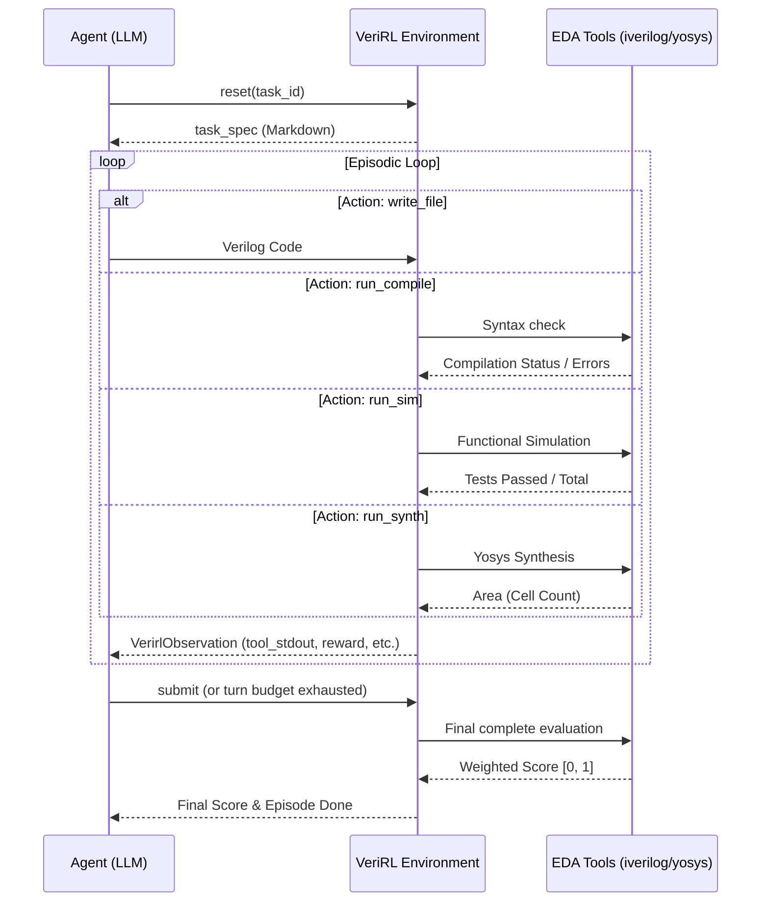

# VeriRL

[](https://huggingface.co/spaces/Supreeth/verirl-env)

An OpenEnv environment for training and evaluating language models on synthesizable Verilog RTL design. Agents implement hardware modules for AI-accelerator primitives and receive graded feedback from real EDA tools — not heuristics, not LLM judges.

## Overview

Writing correct synthesizable RTL is one of the harder practical tasks for current language models. The feedback loop is tight and formal: code either compiles, simulates correctly against a testbench, and meets timing, or it does not. There is no partial credit for "almost right" timing or "mostly correct" FSM logic — the EDA tools are the ground truth.

VeriRL frames this as a multi-step agentic task. The three tasks span the core building blocks of an ML accelerator pipeline:

1. **MAC Unit** — a 2-stage pipelined multiply-accumulate unit, the arithmetic kernel inside every convolution and matrix-multiply accelerator
2. **AXI-Stream FIFO** — a 4-entry FIFO with correct handshaking and backpressure, the standard interconnect protocol between datapath blocks
3. **4×4 Systolic Array** — a weight-stationary matrix multiply engine with diagonal skewing and a 7-cycle latency requirement, structurally similar to the core of a TPU

Each task includes a detailed Verilog interface specification and a testbench that exercises correctness, edge cases, and (for tasks 1 and 3) timing behavior. Scores are computed by compiling agent submissions with `iverilog`, running functional simulation with `vvp`, and estimating area with `yosys` — the same open-source EDA toolchain used in academic and hobbyist chip design.

## Environment Design

The agent interacts with the environment through a five-action loop that mirrors how a hardware engineer would approach a design:



The agent can iterate: fix compile errors, re-run simulation after test failures, check area, and submit when satisfied. Each task has a turn budget (8 / 10 / 12 turns for easy / medium / hard). Episodes also end automatically when the turn budget is exhausted, with a final grade computed on whatever code is on file.

The server supports up to 10 concurrent WebSocket sessions, each with fully isolated episode state.

## Action Space

`VerirlAction` — a Pydantic model with three fields:

| Field | Type | Required | Description |
|---|---|---|---|
| `action_type` | `str` | yes | One of: `write_file`, `run_compile`, `run_sim`, `run_synth`, `submit` |
| `verilog_src` | `str \| None` | for `write_file` | Complete Verilog source code to submit |
| `message` | `str \| None` | no | Agent reasoning note — logged but not graded. This allows Chain-of-Thought (CoT) reasoning to be recorded in the episode trajectory without cluttering the Verilog source code, which is highly beneficial for post-episode analysis or fine-tuning datasets. |

Only one action is executed per step. Actions that have prerequisites (e.g., `run_sim` before `write_file`) return an error in `tool_stderr` without consuming compilation state.

## Observation Space

`VerirlObservation` — returned after every `reset()` and `step()` call:

| Field | Type | Description |
|---|---|---|
| `task_spec` | `str` | Full markdown task specification (set on `reset`, empty on subsequent steps) |
| `tool_stdout` | `str` | Standard output from the EDA tool that ran |
| `tool_stderr` | `str` | Error output or environment error messages |
| `compile_ok` | `bool` | Whether the current code compiles cleanly |
| `tests_passed` | `int` | Number of simulation test assertions that passed |
| `tests_total` | `int` | Total test assertions in the simulation |
| `turn_number` | `int` | Current turn (1-indexed after first step) |
| `turns_remaining` | `int` | Steps left in the episode |
| `current_verilog` | `str \| None` | The Verilog source currently on file |
| `final_score` | `float \| None` | Final score in [0, 1] — set on `submit` or episode expiry |
| `score_breakdown` | `dict \| None` | Per-dimension scores: `compile`, `sim`, `timing`, `area` |
| `reward` | `float` | Per-step reward (see Reward Function below) |
| `done` | `bool` | Whether the episode has ended |

## Tasks

### Task 1: Pipelined MAC Unit — Easy ([View Spec](problems/task1_mac/spec.md))

**Turn budget:** 8 | **Module:** `mac_unit`

A 2-stage pipelined multiply-accumulate unit for signed 8-bit integers with a 32-bit accumulator. Output is valid 2 clock cycles after inputs are presented. The agent must implement correct pipeline registers, synchronous reset, enable gating, and a `clear` signal that respects pipeline latency.

**Testbench:** 22 assertions covering single accumulations, back-to-back pipeline fill, negative inputs, enable hold, clear-in-flight, boundary values, and continuous accumulation sequences.

**Scoring weights:** compile 10% · simulation 60% · pipeline structure (DFF count via synthesis) 20% · area efficiency 10%

---

### Task 2: AXI-Stream FIFO — Medium ([View Spec](problems/task2_axi_fifo/spec.md))

**Turn budget:** 10 | **Module:** `axi_fifo #(.DATA_W=8)`

A 4-entry synchronous FIFO implementing the AXI4-Stream handshake on both slave (input) and master (output) interfaces. The agent must implement correct `valid`/`ready` handshaking, backpressure propagation, circular buffer pointer arithmetic, and `full`/`empty` status flags. A sender must never have data dropped when the receiver stalls.

**Testbench:** 34 assertions covering reset state, single push/pop, fill-to-full, drain-in-order, simultaneous enqueue/dequeue, downstream stall, partial drain with refill, and rapid push/pop interleaving.

**Scoring weights:** compile 10% · functional correctness 40% · protocol compliance (backpressure, no data loss) 30% · area efficiency 20%

---

### Task 3: 4×4 Weight-Stationary Systolic Array — Hard ([View Spec](problems/task3_systolic/spec.md))

**Turn budget:** 12 | **Module:** `systolic_array`

A 4×4 grid of processing elements computing C = A × B for INT8 activations and INT4 weights. Weights are preloaded and held stationary; activations flow left-to-right with diagonal skewing so that PE[i][j] receives its activation at cycle `i+j` from the start pulse. The `done` signal must assert within **7 clock cycles** of `start` — this requires implementing shift-register delay lines of depth `i` on each activation row.

**Testbench:** 7 test cases with 76 individual output assertions, covering identity weights, zero weights, known-value matrix products, powers-of-two weights, single-column weights, uniform weights, and diagonal weights.

**Scoring weights:** compile 5% · functional correctness 50% · timing (done ≤ 7 cycles) 30% · area efficiency 15%

---

## Reward Function

The environment provides a dense per-step reward signal to guide the agent's tool use strategy:

```
reward = +0.02  (any Verilog is on file)
       + 0.05  (current code compiles)
       + 0.10 × (tests_passed / tests_total)        (absolute test ratio)
       + 0.15 × (Δ test ratio vs previous sim run)  (improvement bonus)
       - min(0.01 × turn_number, 0.05)              (time penalty, capped at 0.05)
       clamped to [0.0, 1.0]
```

The improvement bonus rewards each incremental fix: fixing 5 failing tests in one step earns more than fixing 1. `write_file` resets the compile and simulation state so that all progress signals are tied to the current code on file.

The final score (on `submit` or episode expiry) is the weighted EDA-tool score in [0, 1] as described per task above. This is distinct from the cumulative per-step reward and is what is reported as the task score.

## Setup

### Prerequisites

- Python 3.10+
- [`uv`](https://github.com/astral-sh/uv) (recommended) or `pip`
- `iverilog` and `yosys` for local EDA grading:
  ```bash
  # macOS
  brew install icarus-verilog yosys

  # Ubuntu/Debian
  apt-get install iverilog yosys
  ```

### Install

```bash
uv sync
```

### Configuration / Environment Variables

The inference script and environment support the following configuration variables:

| Variable | Default | Description |
|---|---|---|
| `OPENAI_API_KEY` | None | API key for standard OpenAI / Hugging Face Router models. |
| `HF_TOKEN` | None | Alternative for Hugging Face inference tokens. |
| `API_BASE_URL` | `https://router.huggingface.co/v1` | URL for the LLM Inference API. |
| `MODEL_NAME` | `Qwen/Qwen2.5-72B-Instruct` | The specific model to query. |
| `ENV_BASE_URL` | `http://localhost:8000` | Where the VeriRL server is running. |
| `VERIRL_PROBLEMS_DIR` | `<auto-detected>` | Overrides the path to the `/problems` directory. |

### Run the server

```bash
uvicorn server.app:app --reload
# or
uv run --project . server
# or on a custom port
uv run --project . server --port 8001
```

### Run the inference script

The inference script connects to a running server and runs the baseline agent against all three tasks.

```bash
# Set required environment variables
# API key — uses first available of:
export OPENAI_API_KEY=<your_key>   # OpenAI or compatible provider
# export HF_TOKEN=<your_token>     # Hugging Face inference router
export API_BASE_URL=https://router.huggingface.co/v1   # default
export MODEL_NAME=Qwen/Qwen2.5-72B-Instruct            # default
export ENV_BASE_URL=http://localhost:8000              # default

python inference.py
```

The script emits structured logs in the required `[START]` / `[STEP]` / `[END]` format and prints a summary table at completion.

### Docker

```bash
docker build -t verirl-env:latest -f server/Dockerfile .
docker run -p 8000:8000 verirl-env:latest
```

### Deploy to Hugging Face Spaces

**Automatic on every merge to main:**
GitHub Actions CI/CD pipeline validates, builds Docker image, and deploys:

1. Create feature branch: `git checkout -b feature/xyz`
2. Make changes + create changelog fragment
3. Create pull request to main
4. CI checks run (openenv validate, docker build)
5. Merge to main when checks pass
6. Auto-releases + deploys to HF Spaces ✓

See [CONTRIBUTING.md](CONTRIBUTING.md) for development workflow and [.github/DEPLOYMENT.md](.github/DEPLOYMENT.md) for details.

**Manual:**
```bash
export HF_TOKEN=<your_hf_token>
openenv push --repo-id your-org/verirl-env
```

## Baseline Scores

Baseline agent: `openai/gpt-oss-120b` via Hugging Face inference router.

| Task | Difficulty | Score |
|---|---|---|
| mac_unit | easy | 0.154 |
| axi_fifo | medium | 0.650 |
| systolic_array | hard | 0.000 |
| **mean** | | **0.268** |

**Validation:**
The inference script includes task enumeration and grader validation (run before inference):
- All 3 tasks discovered: `mac_unit`, `axi_fifo`, `systolic_array`
- All graders tested with empty submission → all score 0.0 (valid)
- All per-step rewards in valid range [-1.0, 1.0]
- All final scores in valid range [0.0, 1.0]

**Interpretation:**
- MAC unit (easy): 0.154 — some compilation/simulation credit, but test failures
- AXI FIFO (medium): 0.650 — good protocol understanding, partial correctness on edge cases  
- Systolic array (hard): 0.000 — did not attempt (timing constraint is challenging)

## Project Structure

```
verirl_env/
├── openenv.yaml                     # OpenEnv manifest
├── pyproject.toml                   # Package metadata and dependencies
├── inference.py                     # Baseline inference script
├── models.py                        # VerirlAction, VerirlObservation, VerirlState
├── client.py                        # WebSocket client (VerirlEnv)
├── problems/
│   ├── task1_mac/
│   │   ├── spec.md                  # Task specification
│   │   ├── testbench.v              # Icarus Verilog testbench (22 assertions)
│   │   └── reference.v              # Reference implementation
│   ├── task2_axi_fifo/
│   │   ├── spec.md
│   │   ├── testbench.v              # 34 assertions
│   │   └── reference.v
│   └── task3_systolic/
│       ├── spec.md
│       ├── testbench.v              # 76 assertions across 7 test cases
│       └── reference.v
├── server/
│   ├── app.py                       # FastAPI application (REST + WebSocket)
│   ├── verirl_env_environment.py    # Environment logic (reset / step / state)
│   ├── evaluator.py                 # EDA tool wrappers (iverilog, yosys)
│   └── Dockerfile
└── tests/
    ├── test_environment.py
    ├── test_evaluator.py
    ├── test_models.py
    └── test_integration.py
```

## Running Tests

```bash
pytest
# with coverage
pytest --cov
```

## Troubleshooting & FAQ

*   **Synthesis fails with "timeout" error:**
    If the agent generates extremely deep combinatorial loops or massive unrolled blocks, Yosys synthesis can hang. The environment deliberately caps execution (`SYNTH_TIMEOUT=60`) and fails the step gracefully.
*   **"iverilog not found" on Windows:**
    The easiest way to run the environment natively on Windows is through WSL2 or via Docker (see the Docker section above).

## Citation & License

VeriRL is licensed under the [BSD License](LICENSE).

If you use VeriRL in your research, please cite:
```bibtex
@software{verirl2026,
  title = {VeriRL: OpenEnv Verilog Hardware Design Environment},
  author = {Your Name / Organization},
  year = {2026},
  url = {https://github.com/your-org/verirl_env}
}
```
