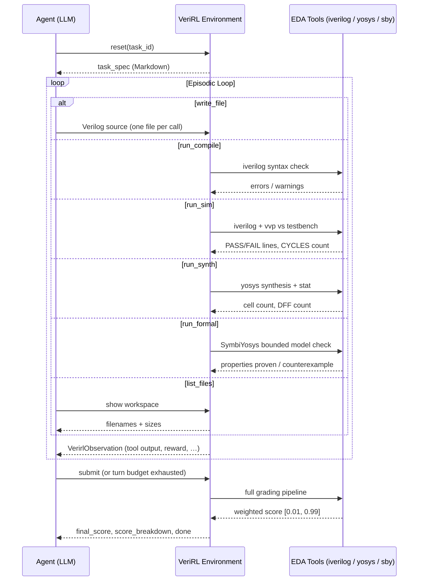

# VeriRL

[](https://huggingface.co/spaces/Supreeth/verirl-env)

**[📖 Read the blog](BLOG.md)** &nbsp;·&nbsp; [📊 W&B Report](https://api.wandb.ai/links/supreethrao/cdpml221) &nbsp;·&nbsp; [📈 W&B Run Logs](https://wandb.ai/supreethrao/verirl-grpo/runs/zn6azp6t?nw=nwusersupreethrao) &nbsp;·&nbsp; [🤗 SFT Checkpoint](https://huggingface.co/Supreeth/verirl-sft-qwen3-4b-thinking-merged) &nbsp;·&nbsp; [🤗 GRPO Checkpoint](https://huggingface.co/Supreeth/verirl-rlvr-qwen3-4b-thinking)

An OpenEnv environment for training and evaluating language models on synthesizable Verilog RTL design. Agents implement hardware modules for AI-accelerator primitives and receive graded feedback from real EDA tools — not heuristics, not LLM judges.

## Overview

Writing correct synthesizable RTL is one of the harder practical tasks for current language models. The feedback loop is tight and formal: code either compiles, simulates correctly against a testbench, and meets timing/area targets — or it does not. There is no partial credit for "almost right" logic; the EDA tools are the ground truth.

VeriRL frames this as a multi-step agentic task covering the full ML accelerator primitive stack, from data movement to compute to activation functions. The environment exposes **10 tasks** spanning easy combinational blocks through hard multi-cycle pipelined designs, with optional formal verification via SymbiYosys for tasks that have safety-critical properties.

## Environment Design

The agent interacts through a tool-use loop that mirrors how a hardware engineer works:



The server supports up to 10 concurrent WebSocket sessions with fully isolated episode state (`SUPPORTS_CONCURRENT_SESSIONS = True`).

## Action Space

`VerirlAction` — a Pydantic model:

| Field | Type | Required | Description |
|---|---|---|---|
| `action_type` | `str` | yes | One of: `write_file`, `run_compile`, `run_sim`, `run_synth`, `run_formal`, `list_files`, `submit` |
| `verilog_src` | `str \| None` | for `write_file` | Complete Verilog source for one file |
| `filename` | `str \| None` | for `write_file` | Target filename (default: `design.v`). Supports multi-file projects. |
| `message` | `str \| None` | no | Agent reasoning note — logged for trajectory analysis, not graded |

**Multi-file support:** call `write_file` once per file with distinct filenames (e.g., `pe.v`, `controller.v`). All files are compiled and simulated together. The `list_files` action shows the current workspace.

## Observation Space

`VerirlObservation` — returned after every `reset()` and `step()`:

| Field | Type | Description |
|---|---|---|
| `task_spec` | `str` | Full Markdown task specification (set on `reset`, empty on subsequent steps) |
| `tool_stdout` | `str` | Standard output from the EDA tool that ran |
| `tool_stderr` | `str` | Error output or environment error messages |
| `compile_ok` | `bool` | Whether the current code compiles cleanly |
| `tests_passed` | `int` | Number of simulation test assertions that passed |
| `tests_total` | `int` | Total test assertions in the simulation |
| `turn_number` | `int` | Current turn (1-indexed after first step) |
| `turns_remaining` | `int` | Steps left in the episode |
| `current_verilog` | `str \| None` | Primary source file (`design.v`) for backward compatibility |
| `current_files` | `dict[str, str]` | All files in the workspace: `{filename: source}` |
| `formal_properties_proven` | `int \| None` | Properties proven by SymbiYosys (if `run_formal` was called) |
| `formal_properties_total` | `int \| None` | Total formal properties checked |
| `final_score` | `float \| None` | Final score in [0.01, 0.99] — set on `submit` or episode expiry |
| `score_breakdown` | `dict \| None` | Per-dimension scores: `compile`, `sim`, `timing`, `area`, `formal` |
| `reward` | `float` | Per-step reward (see Reward Function below) |
| `done` | `bool` | Whether the episode has ended |

## Tasks

Ten tasks, increasing in difficulty. All are AI-accelerator primitives.

### Easy (turn budget: 6–8)

#### Task 1: Pipelined MAC Unit ([spec](problems/task1_mac/spec.md))
**Module:** `mac_unit` | **Turns:** 8

A 2-stage pipelined multiply-accumulate unit for signed 8-bit integers with a 32-bit accumulator. Must implement correct pipeline registers, synchronous reset, enable gating, and a `clear` signal that respects pipeline latency.

**Testbench:** 22 assertions — single accumulations, back-to-back pipeline fill, negative inputs, enable hold, clear-in-flight, boundary values.

**Scoring:** compile 10% · simulation 60% · pipeline structure (DFF count) 20% · area 10%

---

#### Task 4: Parameterized ReLU-Clip Unit ([spec](problems/task4_relu_clip/spec.md))
**Module:** `relu_clip #(.IN_W, .OUT_W)` | **Turns:** 6 | **Formal:** ✓

Fully combinational ReLU activation followed by saturating cast to a narrower unsigned integer — the activation primitive in every quantized neural-network inference pipeline.

**Testbench:** exhaustive corner cases (negative, zero, in-range, above-MAX_OUT). **Formal properties (6):** negative→zero, in-range passthrough, upper saturation, `saturated` flag, no X/Z.

**Scoring:** compile 10% · simulation 75% · formal verification 10% · area 5%

---

#### Task 5: Parameterized Barrel Shifter ([spec](problems/task5_barrel_shifter/spec.md))
**Module:** `barrel_shifter #(.WIDTH)` | **Turns:** 6

Fully combinational barrel shifter supporting left shift, logical right shift, and arithmetic right shift for any `WIDTH`. Controlled by `direction` and `arithmetic` select bits.

**Testbench:** left/logical-right/arithmetic-right shifts at all amounts, sign extension verification.

**Scoring:** compile 10% · simulation 80% · area 10%

---

### Medium (turn budget: 8–10)

#### Task 2: AXI-Stream FIFO ([spec](problems/task2_axi_fifo/spec.md))
**Module:** `axi_fifo #(.DATA_W=8)` | **Turns:** 10

A 4-entry synchronous FIFO implementing the AXI4-Stream handshake on both slave (input) and master (output) interfaces. Correct `valid`/`ready` handshaking, backpressure propagation, and `full`/`empty` flags required.

**Testbench:** 34 assertions — reset state, fill-to-full, drain-in-order, simultaneous enqueue/dequeue, downstream stall, rapid interleaving.

**Scoring:** compile 10% · simulation 70% · area 20%

---

#### Task 6: Dual-Read Register File ([spec](problems/task6_register_file/spec.md))
**Module:** `register_file #(.ADDR_W=5, .DATA_W=32)` | **Turns:** 8 | **Formal:** ✓

RISC-style register file with two asynchronous read ports, one synchronous write port, and register 0 hardwired to zero — the standard register file for an inference-engine control path.

**Testbench:** write-read round-trips, r0 zero invariant, simultaneous dual-read, write priority. **Formal properties:** r0=0 always, write-then-read consistency.

**Scoring:** compile 10% · simulation 70% · formal verification 10% · area 10%

---

#### Task 7: Parameterized Ring Buffer ([spec](problems/task7_ring_buffer/spec.md))
**Module:** `ring_buffer #(.DEPTH, .DATA_W)` | **Turns:** 10

Power-of-2-depth circular FIFO with `push`/`pop` interface, `full`/`empty` flags, and `count` output — the standard data structure for KV-cache management in inference accelerators.

**Testbench:** push-until-full, pop-until-empty, simultaneous push+pop, wrap-around pointer arithmetic, count accuracy.

**Scoring:** compile 10% · simulation 70% · area 20%

---

#### Task 8: Pipelined INT8 Dot Product ([spec](problems/task8_dot_product/spec.md))
**Module:** `dot_product_4` | **Turns:** 8

2-stage pipelined unit computing the dot product of two 4-element signed INT8 vectors — the innermost operation in attention score and fully-connected layer computation.

**Testbench:** known-value vectors, zero vectors, pipeline latency verification, `valid` signal propagation.

**Scoring:** compile 10% · simulation 60% · pipeline structure (DFF count) 20% · area 10%

---

#### Task 9: 3-Tap FIR Filter ([spec](problems/task9_fir_filter/spec.md))
**Module:** `fir3` | **Turns:** 10

Direct-form I 3-tap FIR filter: `y[n] = h0·x[n] + h1·x[n-1] + h2·x[n-2]` with signed 8-bit samples and programmable coefficients. Output latency of 1 clock cycle.

**Testbench:** impulse response, step response, coefficient sweep, delay-line correctness, `valid` propagation.

**Scoring:** compile 10% · simulation 60% · pipeline structure (DFF count) 20% · area 10%

---

### Hard (turn budget: 12–15)

#### Task 3: 4×4 Weight-Stationary Systolic Array ([spec](problems/task3_systolic/spec.md))
**Module:** `systolic_array` | **Turns:** 12

A 4×4 grid of PEs computing C = A × B for INT8 activations and INT4 weights. Activations must be diagonally skewed (PE[i][j] receives its activation at cycle `i` from `start`). The `done` signal must assert within **10 clock cycles** of `start`.

**Testbench:** 7 test cases with 76 output assertions — identity, zero, known-value products, powers-of-two, uniform and diagonal weights.

**Scoring:** compile 5% · simulation 50% · timing (done ≤ 10 cycles) 30% · area 15%

---

#### Task 10: IEEE 754 FP16 Adder ([spec](problems/task10_fp16_adder/spec.md))
**Module:** `fp16_adder` | **Turns:** 15 | **Formal:** ✓

Combinational IEEE 754 half-precision floating-point adder handling normal numbers, zero, infinity, and NaN propagation. Rounding toward zero. This is the arithmetic primitive of every GPU tensor core.

**Testbench:** normal addition, subtraction, infinity propagation, NaN propagation, ∞ − ∞ = NaN, zero handling, alignment shifts. **Formal properties:** NaN propagation, infinity arithmetic, zero identity.

**Scoring:** compile 5% · simulation 60% · formal verification 15% · area 20%

---

## Reward Function

Dense per-step reward signal:

```
reward = +0.02  (any Verilog is on file)
       + 0.05  (current code compiles cleanly)
       + 0.10 × (tests_passed / tests_total)          (absolute test ratio)
       + 0.15 × Δ(test ratio vs previous sim run)     (improvement bonus)
       + 0.05 × (formal_proven / formal_total)        (if run_formal was called)
       - min(0.01 × turn_number, 0.05)                (time penalty, capped)
       clamped to [0.01, 0.99]
```

The final score (on `submit` or episode expiry) is the weighted EDA-tool score in [0.01, 0.99] as described per task. This is distinct from the per-step reward and is what is reported as the task score. All scores are strictly clamped to [0.01, 0.99] — never 0.0 or 1.0 — for training stability.

## RLVR Training

VeriRL ships a full two-phase RLVR training stack (SFT warm-start → GRPO fine-tuning) targeting `Qwen3-4B-Thinking`.

**Algorithm:** GRPO (Group Relative Policy Optimization) via TRL
**Model:** `Qwen/Qwen3-4B-Thinking-2507` → SFT → GRPO with QLoRA (rank-1)
**Infrastructure:** HuggingFace Jobs (primary) or Modal Labs (alternative)

Training is split across two SFT/GRPO extras that pin incompatible TRL versions:

| Phase | Extra | Script | Hardware |
|-------|-------|--------|----------|
| SFT warm-start | `sft` (TRL 0.x + Unsloth) | `training/hf_train_sft.py` | 1×A10G |
| RLVR GRPO | `grpo` (TRL 1.x + vLLM) | `training/hf_train_grpo.py` | 2×A10G or 1×H200 |

### HuggingFace Jobs (recommended)

```bash
# One-time: log in and register your HF token
huggingface-cli login

# Set the VeriRL env server URL (your deployed HF Space)
export VERIRL_ENV_URL=https://<username>-verirl-env.hf.space

# Phase 1 — SFT warm-start
python infra/hf_jobs.py sft

# Phase 2 — RLVR GRPO (from SFT checkpoint)
python infra/hf_jobs.py train

# Monitor jobs
python infra/hf_jobs.py ps
python infra/hf_jobs.py logs <job-id>

# Dry-run (print hf CLI command without submitting)
python infra/hf_jobs.py --dry-run train
```

### Modal Labs (alternative)

```bash
# One-time: create the Modal secret
modal secret create verirl-training \
    HF_TOKEN=hf_xxx \
    WANDB_API_KEY=wandb_xxx \
    VERIRL_ENV_URL=https://your-space.hf.space

# Phase 1 — SFT warm-start (H100, ~8h)
modal run infra/modal_infra.py::sft

# Phase 2 — RLVR GRPO (2×L4, ~4h)
modal run infra/modal_infra.py::train

# Deploy the env server on Modal (no GPU needed)
modal deploy infra/modal_env.py
```

### Local smoke test

```bash
# Start the VeriRL server locally
uv run --project . server

# Verify env connectivity (no training extras required)
export VERIRL_ENV_URL=http://localhost:8000
python training/train.py --smoke
```

### Training configuration

All hyperparameters live in [`config.yaml`](config.yaml):

```yaml
training:
  model:
    base_model: Supreeth/verirl-sft-qwen3-4b-thinking
    vllm_base_model: Supreeth/verirl-sft-qwen3-4b-thinking-merged
    hf_output_repo: Supreeth/verirl-rlvr-qwen3-4b-thinking
  grpo:
    num_generations: 4        # G in GRPO
    max_steps: 500
    learning_rate: 5.0e-5
    kl_coeff: 0.05            # β — KL penalty
    reward_weights: [0.05, 0.25, 0.40, 0.30]  # tool, compile, sim, final
  lora:
    r: 1                      # rank-1: enough for RL signal, avoids over-regularisation
  curriculum:
    task_difficulty_weights:
      easy: 0.40              # mac_unit, relu_clip, barrel_shifter
      medium: 0.40            # axi_fifo, register_file, ring_buffer, dot_product, fir_filter
      hard: 0.20              # systolic_array, fp16_adder
```

The curriculum sampler draws tasks weighted by difficulty bucket. Task specs are read from disk at dataset-build time — no server required for the training data pipeline.

GPU strategy (auto-detected at runtime):
- **2 GPUs**: vLLM server on GPU 1 (full 22 GB KV cache) + training on GPU 0
- **1 GPU**: vLLM colocate mode (context capped at 8192 to avoid OOM)

## Setup

### Prerequisites

- Python 3.10+
- [`uv`](https://github.com/astral-sh/uv) (recommended) or `pip`
- `iverilog` and `yosys` for local EDA grading:
  ```bash
  # macOS
  brew install icarus-verilog yosys

  # Ubuntu/Debian
  apt-get install iverilog yosys
  ```
- `sby` (SymbiYosys) for formal verification (optional — gracefully skipped if not installed):
  ```bash
  # macOS
  brew install symbiyosys

  # Ubuntu/Debian
  apt-get install symbiyosys
  ```

### Install

```bash
uv sync              # core runtime (server + inference)
uv sync --extra dev  # + pytest, towncrier
uv sync --extra sft  # + SFT training stack (Unsloth, TRL 0.x)
uv sync --extra grpo # + GRPO training stack (TRL 1.x, vLLM)
```

Note: `sft` and `grpo` have conflicting TRL version pins and cannot be installed together.

### Configuration

| Variable | Default | Description |
|---|---|---|
| `OPENAI_API_KEY` | None | API key for standard OpenAI / Hugging Face Router models |
| `HF_TOKEN` | None | Hugging Face inference token |
| `API_BASE_URL` | `https://router.huggingface.co/v1` | LLM inference API endpoint |
| `MODEL_NAME` | `Qwen/Qwen2.5-72B-Instruct` | Model to use for inference |
| `ENV_BASE_URL` | `http://localhost:8000` | VeriRL server URL |
| `VERIRL_PROBLEMS_DIR` | `<auto-detected>` | Override path to the `problems/` directory |
| `VERIRL_ENV_URL` | `http://localhost:8000` | Environment URL for training (set as HF secret or Modal secret) |

### Run the server

```bash
uv run --project . server          # production
uvicorn server.app:app --reload    # development with hot-reload
uv run --project . server --port 8001
```

### Run the inference script

```bash
export OPENAI_API_KEY=<your_key>
export API_BASE_URL=https://router.huggingface.co/v1  # default
export MODEL_NAME=Qwen/Qwen2.5-72B-Instruct           # default
export ENV_BASE_URL=http://localhost:8000             # default

python inference.py
```

The script emits structured logs in `[START]` / `[STEP]` / `[END]` format.

### Docker

```bash
docker build -t verirl-env:latest -f server/Dockerfile .
docker run -p 8000:8000 verirl-env:latest
```

### Deploy to Hugging Face Spaces

**Automatic on every merge to main:**

1. Create feature branch: `git checkout -b feature/xyz`
2. Make changes + create a changelog fragment in `.changelog.d/`
3. Open a pull request to `main`
4. CI checks run (`openenv validate`, `docker build`)
5. Merge when checks pass → auto-deploys to HF Spaces

See [CONTRIBUTING.md](CONTRIBUTING.md) for full workflow.

## Project Structure

```
verirl_env/
├── config.yaml                        # Central configuration (server, inference, training)
├── pyproject.toml                     # Package metadata and dependencies
├── inference.py                       # Baseline inference script
├── models.py                          # VerirlAction, VerirlObservation, VerirlState
├── client.py                          # WebSocket client (verirl_env)
├── infra/
│   ├── hf_jobs.py                     # HF Jobs submit CLI (sft / train / ps / logs)
│   ├── modal_env.py                   # Modal deployment for the env server (CPU)
│   ├── modal_infra.py                 # Modal Labs adapter (sft / train functions)
│   └── modal_merge.py                 # Modal utility: merge SFT LoRA and push to Hub
├── problems/
│   ├── task1_mac/                     # Pipelined MAC Unit (easy, 8 turns)
│   │   ├── spec.md
│   │   ├── testbench.v                # 22 assertions
│   │   └── reference.v
│   ├── task2_axi_fifo/                # AXI-Stream FIFO (medium, 10 turns)
│   ├── task3_systolic/                # 4×4 Systolic Array (hard, 12 turns)
│   ├── task4_relu_clip/               # ReLU-Clip Unit (easy, 6 turns, formal)
│   │   └── properties.sv             # SymbiYosys formal properties (6 assertions)
│   ├── task5_barrel_shifter/          # Barrel Shifter (easy, 6 turns)
│   ├── task6_register_file/           # Register File (medium, 8 turns, formal)
│   ├── task7_ring_buffer/             # Ring Buffer (medium, 10 turns)
│   ├── task8_dot_product/             # INT8 Dot Product (medium, 8 turns)
│   ├── task9_fir_filter/              # 3-Tap FIR Filter (medium, 10 turns)
│   └── task10_fp16_adder/             # IEEE 754 FP16 Adder (hard, 15 turns, formal)
├── server/
│   ├── app.py                         # FastAPI application (REST + WebSocket)
│   ├── verirl_env_environment.py      # Environment logic (reset / step / grading)
│   ├── evaluator.py                   # EDA tool wrappers (iverilog, yosys, sby)
│   └── Dockerfile
├── training/
│   ├── config.py                      # SFTConfig + TrainConfig dataclasses + YAML loading
│   ├── curriculum.py                  # Task difficulty buckets, sampling, system prompt
│   ├── dataset.py                     # GRPO curriculum dataset builder
│   ├── environment.py                 # VerirlToolEnv for TRL environment_factory
│   ├── hf_train_grpo.py               # HF Jobs GRPO entry point (bootstraps + trains)
│   ├── hf_train_sft.py                # HF Jobs SFT entry point (bootstraps + trains)
│   ├── test_sft.py                    # SFT model sanity check (runs against Hub checkpoint)
│   ├── reward.py                      # Four reward functions for GRPOTrainer
│   ├── runtime.py                     # Shared utilities: vLLM server, env health check
│   ├── sft.py                         # SFT training loop (backend-agnostic)
│   ├── train.py                       # Local runner CLI (GRPO + smoke test)
│   ├── trainer.py                     # Model loading + GRPO training loop (backend-agnostic)
│   └── wandb_task_logging.py          # Per-task reward buffering for W&B
└── tests/
    ├── conftest.py                    # Shared fixtures (reference Verilog, EDA skips)
    ├── test_environment.py            # Environment step/reset/reward tests
    ├── test_evaluator.py              # EDA tool wrapper tests
    ├── test_new_tasks.py              # Tests for tasks 4–10 (reset, compile, sim, grade)
    ├── test_models.py                 # Pydantic model tests
    └── test_integration.py            # End-to-end server tests
```

## Running Tests

```bash
pytest                 # all tests (EDA tests auto-skip if tools not installed)
pytest --cov           # with coverage report
pytest -k "not integration"  # skip server integration tests
```

## Troubleshooting

- **Synthesis timeout:** Yosys caps at 60s (`SYNTH_TIMEOUT`). Deep combinatorial loops in agent code will fail gracefully — no hang.
- **Formal verification skipped:** If `sby` is not installed, `run_formal` returns an INFO message and the formal weight is redistributed to simulation in the final score.
- **"iverilog not found" on Windows:** Use WSL2 or Docker.
- **Modal training: "module not found":** Ensure `modal secret create verirl-training` has been run and `VERIRL_ENV_URL` points to a live environment server.
